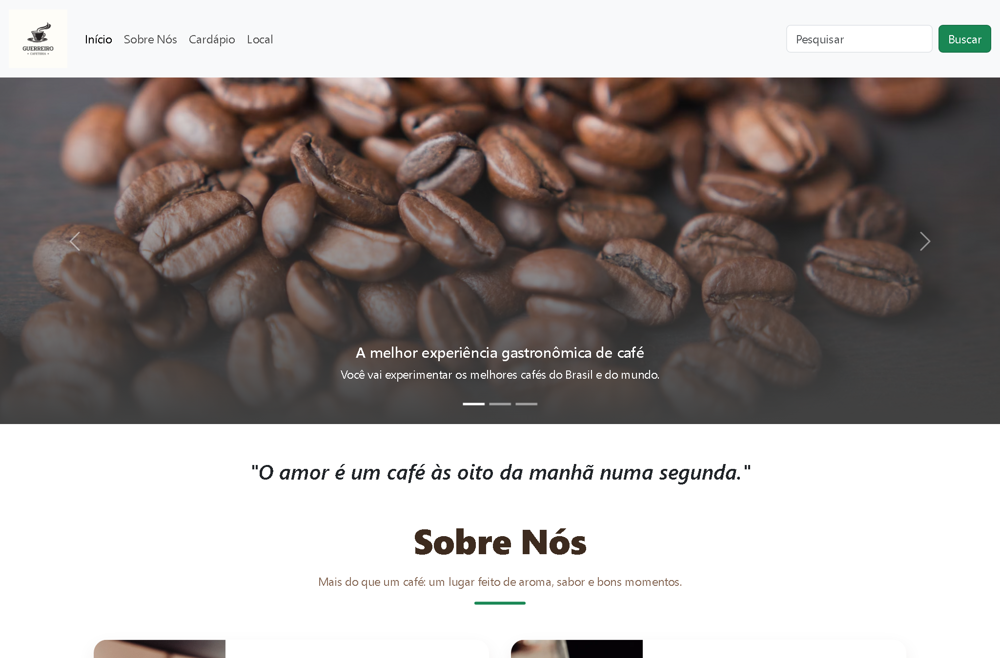
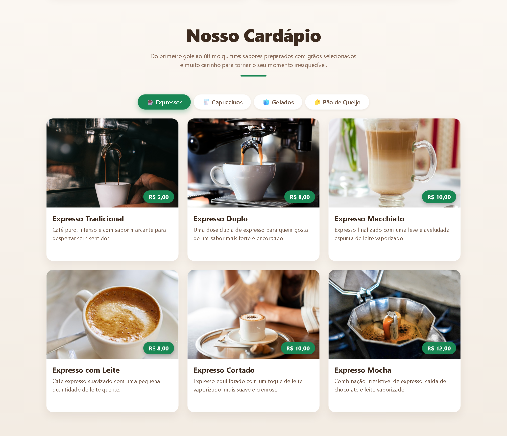
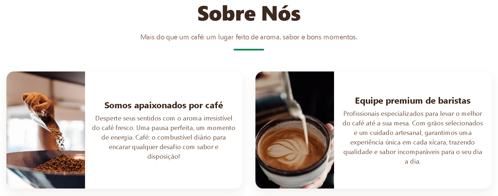
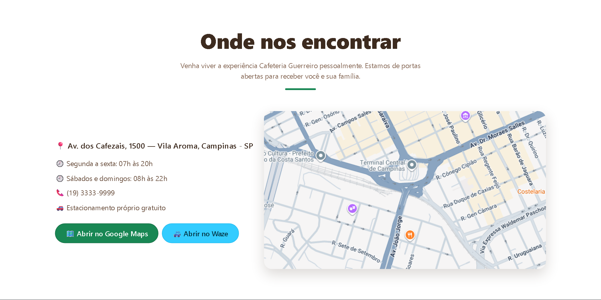

# ☕ Cafeteria Guerreiro

> Landing page fictícia de uma cafeteria, desenvolvida como projeto de portfólio para demonstrar maquetação responsiva, uso do Bootstrap 5 e um visual moderno e atraente.


---

## ✨ Visão geral

Site institucional de uma cafeteria com página única (_single page_) e navegação por âncoras. O foco foi criar uma interface **limpa, responsiva e apetitosa**, que estimule o consumo dos produtos por meio de boas fotos, tipografia consistente e microinterações.

## 🚀 Demonstração

| Início (carrossel) | Cardápio |
| :---: | :---: |
|  |  |

| Sobre Nós | Local |
| :---: | :---: |
|  |  |

<p align="center">
  
</p>

## 🧩 Funcionalidades

- **Carrossel automático** na abertura, com rotação a cada 5s e controles manuais (Bootstrap Carousel).
- **Seção Sobre Nós** com cards que apresentam a proposta da cafeteria.
- **Cardápio por categorias** (Expressos, Capuccinos, Gelados e Pão de Queijo) usando abas, cards com _hover_, zoom na imagem e selo de preço.
- **Seção Local** com mapa incorporado do Google Maps e botões para abrir a rota diretamente no **Google Maps** ou no **Waze**.
- **Busca com destaque**: pesquisa o termo no conteúdo da página, realça as ocorrências e rola até a primeira.
- **Layout totalmente responsivo**, do desktop ao celular.
- Rolagem suave com compensação da navbar fixa (`scroll-padding`).

## 🛠️ Tecnologias

- **HTML5** semântico
- **CSS3** (estilos próprios em `assets/css/styles.css`)
- **JavaScript** puro (busca em `assets/js/script.js`)
- **Bootstrap 5.3** (grid, navbar, carousel, tabs e modal) via CDN

## 📂 Estrutura do projeto

```
Cafeteria/
├── index.html                # Página principal
├── assets/
│   ├── css/styles.css         # Estilos personalizados
│   ├── js/script.js           # Busca com destaque
│   └── images/                # Fotos dos produtos e do ambiente
├── docs/screenshots/          # Imagens usadas neste README
└── README.md
```

## ▶️ Como executar

Por ser um site estático, basta abrir o `index.html` no navegador:

```bash
# clone o repositório
git clone https://github.com/mrguerreiro/cafeteria.git
cd cafeteria

# abra o index.html no navegador (ou use uma extensão como o Live Server)
```

> 💡 Para melhor experiência (carregamento do mapa e do Bootstrap via CDN), recomenda-se abrir com um servidor local, como o **Live Server** do VS Code.

## 📝 Observações

- Projeto **fictício**, sem fins comerciais, criado para fins de estudo e portfólio.
- Endereço, telefone e localização no mapa são meramente ilustrativos.

---

Desenvolvido por **Guerreiro** — projeto de portfólio.
